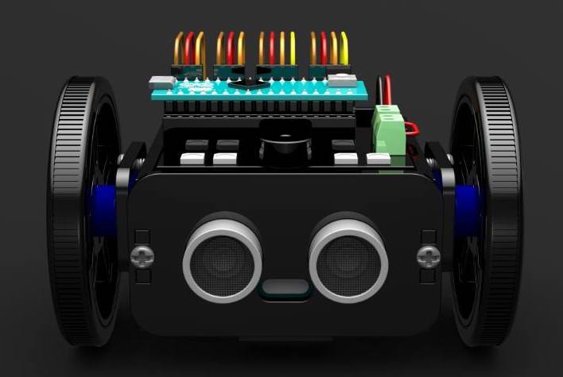
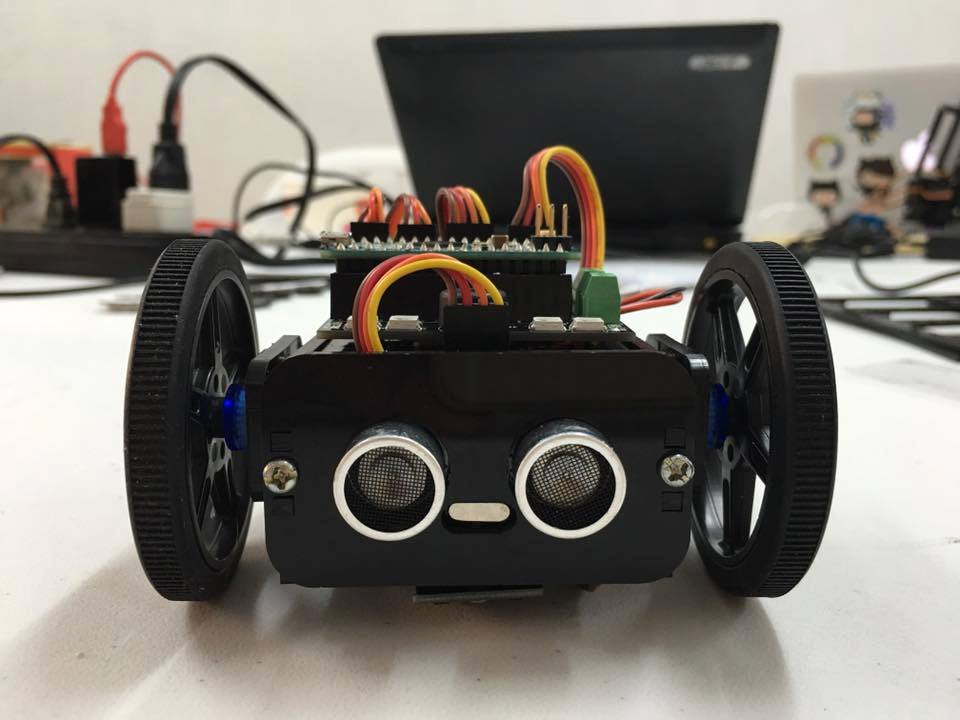
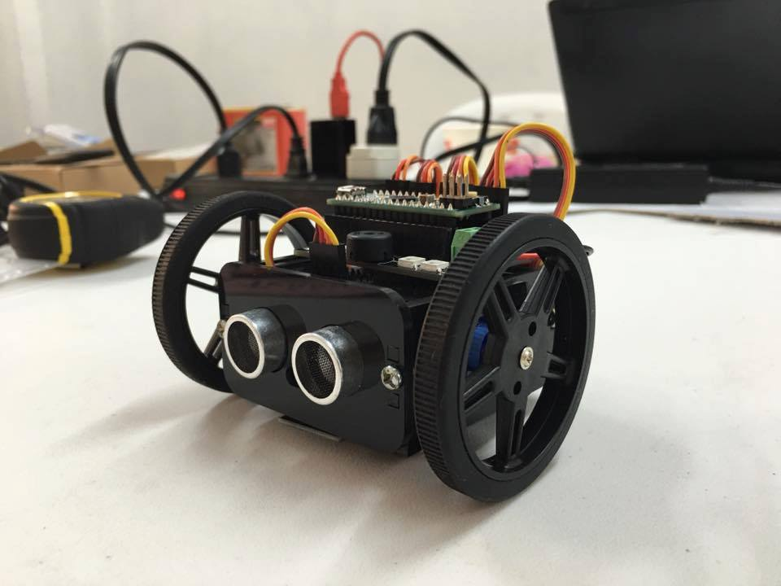

# Maya Robot 

| |  | 
--- | --- | 

| |  | 
--- | --- | 

Nanica Labs was a robotics education startup based in the Philippines that operated from 2014 to 2016. During its journey, the team was recognized as a Top 3% finalist among more than 500 applicants in the IdeaSpace Competition 2016.

One of Nanica Labs' flagship projects was Robot Maya—an affordable, open-source educational robot designed to make early robotics education more accessible.

Built to be hackable and easy to learn from, Robot Maya includes publicly available mechanical designs, PCB designs, lesson plans, and other educational resources. All project artifacts are available for download without licensing restrictions.

While Nanica Labs is no longer in operation, we hope these artifacts continue to inspire educators, makers, and students.

# Archive
- Facebook — https://www.facebook.com/nanicalabs/
- YouTube — https://www.youtube.com/@nanicalabs3474
- Medium — https://medium.com/@nanicalabs
- Looking Back: Nanica Labs Year-End Video https://www.youtube.com/watch?v=rtS7y3G6EyI
- IdeaSpace 2016 Pitch Video https://www.youtube.com/watch?v=hNzD0EEuWf8
